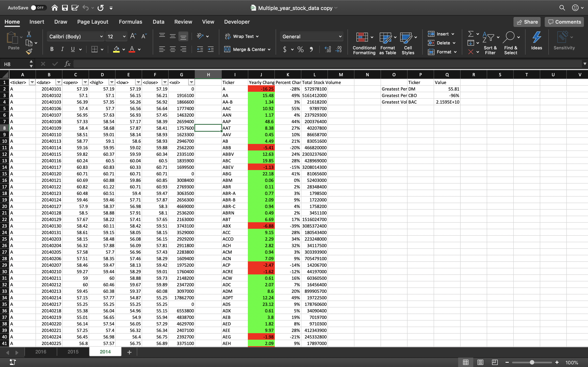
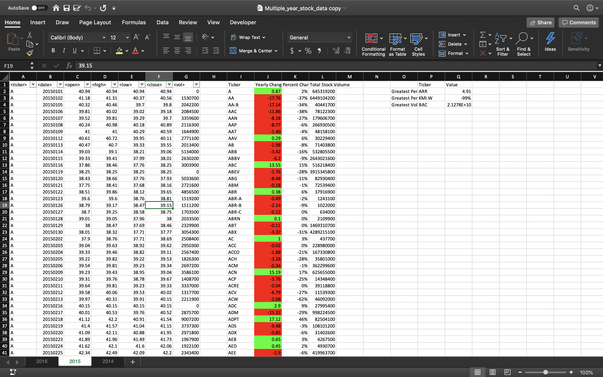
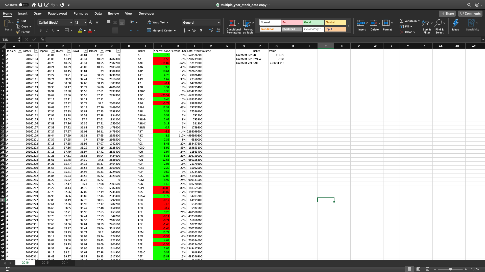

# VBA Stock Analysis

This project uses VBA script (_Stock Analysis Source Code.bas_) to analyze each stock in excel file in **Resources** folder.
It will print out summary statistics after you run the program. 

### **Functionality of this program**
* The script will loop through all the stocks in each worksheet for one year and output the following information.

   * The ticker symbol.

   * Yearly change from opening price at the beginning of a given year to the closing price at the end of that year.

   * The percent change from opening price at the beginning of a given year to the closing price at the end of that year.

   * The total stock volume of the stock.

   * The stock with the "Greatest % increase", "Greatest % decrease" and "Greatest total volume". 

 * The conditional formatting that will highlight positive change in green and negative change in red.

### **Results**

